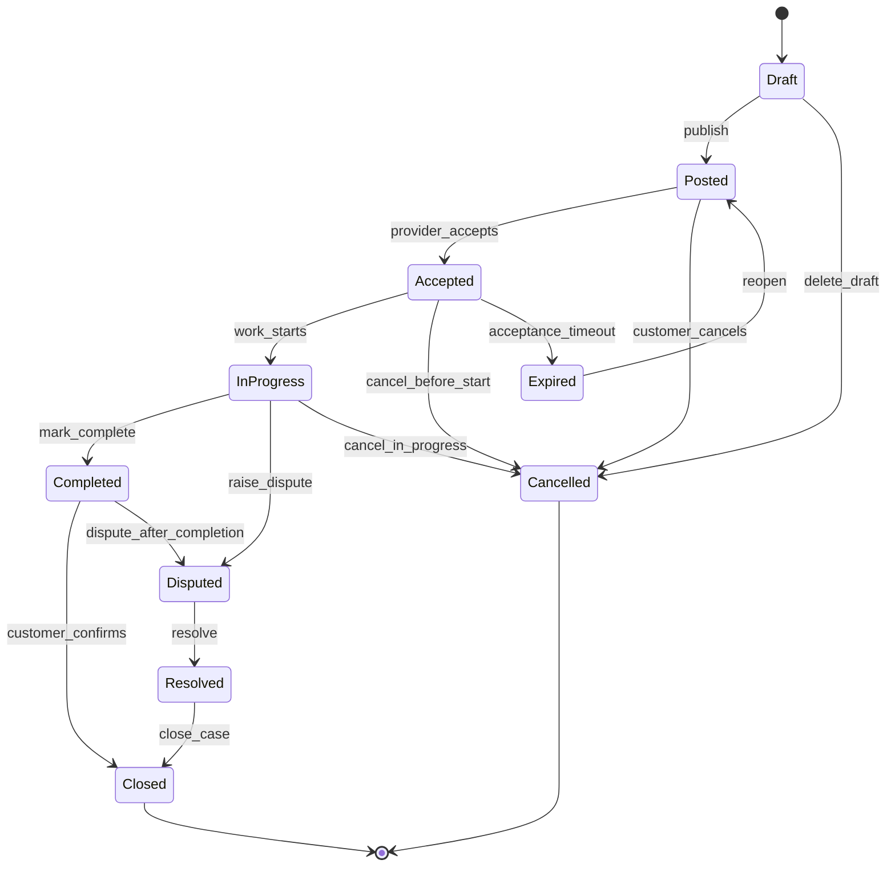

# RentADad.Platform

> An API-first re-implementation of the Rent-a-Dad domain, focused on lifecycle modelling, boundaries, and long-term maintainability.

**RentADad.Platform** revisits the same real-world service marketplace domain as the original Rent-a-Dad project, but approaches it from a different engineering perspective.

Where the original project demonstrated **end-to-end full-stack delivery**, this platform edition focuses on **domain modelling, API design, and system evolution**.

This is not a rewrite for novelty — it is a deliberate evolution.

## Why This Project Exists

The original Rent-a-Dad application answered an important question:

> *Can I design and deliver a realistic full-stack application with clean structure and working workflows?*

RentADad.Platform asks a different question:

> *How would I design this system now, knowing it will need to evolve, scale, and support multiple clients over time?*

The goal is to demonstrate learning progression by revisiting the **same domain** with:

- clearer boundaries

- stronger domain modelling

- API-first thinking

- explicit lifecycle management

This mirrors how real systems grow in industry.

## What’s Different From the Original Rent-a-Dad

| Original Rent-a-Dad | RentADad.Platform |
| ------------------- | ----------------- |
| ASP.NET Core MVC | ASP.NET Core Web API |
| Razor views | API-only (no frontend) |
| Feature-driven design | Domain-driven lifecycle modelling |
| UI-centric workflows | Explicit state transitions |
| Single delivery target | Designed for multiple clients |

Both projects are intentionally kept — together they show **delivery and evolution**.

## Architectural Goals

RentADad.Platform is designed around the following principles:

- **API-first** — clients are consumers, not drivers of design

- **Explicit domain rules** — business invariants are enforced centrally

- **Lifecycle modelling** — jobs, bookings, and providers move through defined states

- **Separation of concerns** — domain, application, and infrastructure are isolated

- **Change tolerance** — the system should accept new requirements without collapse

The emphasis is on **reasoning about behaviour**, not just implementing endpoints.

## Architecture Overview

- **API**: ASP.NET Core Web API (.NET 8 / 9)

- **Domain Layer**: Aggregates, entities, value objects

- **Application Layer**: Use cases, orchestration, validation

- **Infrastructure Layer**: EF Core, persistence, external integrations

- **Auth**: JWT + policy-based authorisation

- **Database**: PostgreSQL (Docker-friendly, production-aligned)

There is deliberately **no UI layer** in this repository.

## Domain Focus

Rather than modelling screens or actions, this project models **state and behaviour**, such as:

- Job lifecycle
  Draft → Posted → Accepted → In Progress → Completed → Closed / Disputed

- Booking rules and invariants

- Provider availability and constraints

- Cancellation and expiry policies

- Time-based behaviour (for example, stale or unconfirmed bookings)

- Business rules live in the domain, not in controllers.

## Job lifecycle (Mermaid state diagram)



## Notes

- `Expired` represents time-based transitions (e.g., acceptance window elapsed).
- `Disputed` captures exception handling paths rather than the happy flow.

## Project Structure

```text
src/
├─ RentADad.Domain          # Entities, aggregates, domain rules
├─ RentADad.Application     # Use cases, DTOs, validation
├─ RentADad.Infrastructure  # EF Core, persistence, external services
├─ RentADad.Api             # Controllers, auth, API configuration
└─ RentADad.Tests           # Domain and application tests
```

Dependencies flow inward only.

## Running Locally

### Prerequisites

- .NET SDK (LTS)

- Docker (for PostgreSQL)

### Start the system

```shell
docker compose up -d
dotnet restore
dotnet ef database update
dotnet run --project src/RentADad.Api
```

Swagger / OpenAPI will be available locally for exploration.

See `docs/DEV_SETUP.md` for environment variables, ports, and secrets.
See `docs/API_CONVENTIONS.md` for initial API surface area and naming conventions.

## Non-Goals

RentADad.Platform deliberately avoids:

- Rebuilding a frontend

- Microservices or distributed complexity

- Real payment processing (interfaces only)

- Premature performance optimisation

- Claiming “production-ready” status

This is a **learning-through-design project**, not a SaaS product.

## Status

Active development.

The focus is on **design clarity, domain correctness, and defensible decisions**, not feature volume.

## What This Project Demonstrates

- Revisiting a domain with improved abstractions

- API-first design and boundary discipline

- Explicit lifecycle and state modelling

- Separation between orchestration and execution

- The ability to evolve a system intentionally
